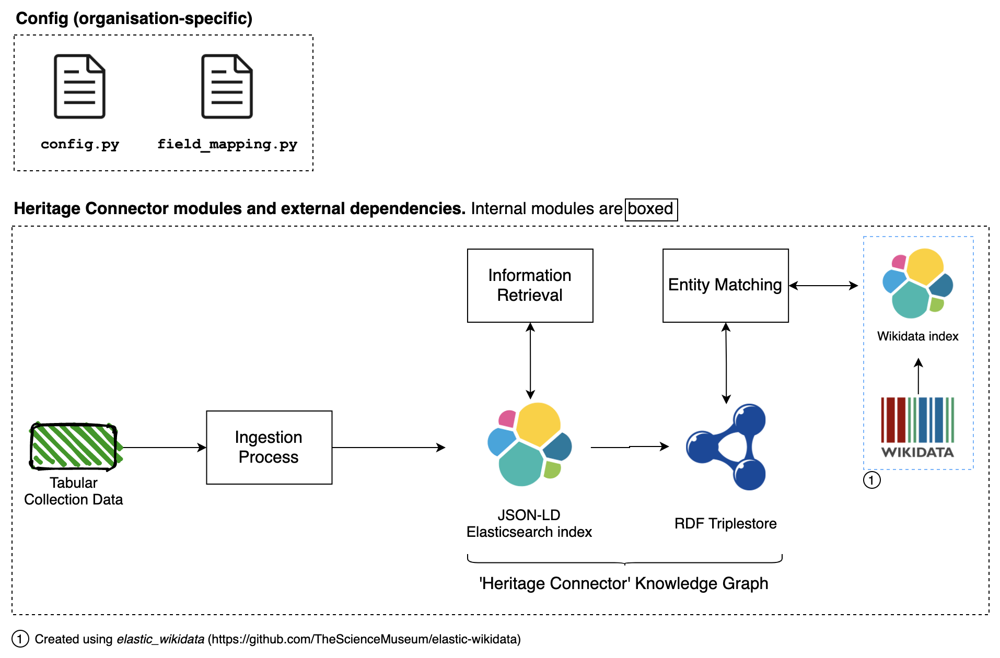

Architecture
============

Heritage Connector contains three main modules: 

* **Ingestion**, for converting tabular data to RDF and mining it for Wikidata links; 
* **Entity Matching**, for matching entities to Wikidata using :code:`owl:sameAs` links; and 
* **Information Retrieval**, for generating new entities and relations in the graph from text data.  

The diagram below shows the parts of Heritage Connector as well as its dependencies.

    
    Overall architecture of the Heritage Connector system. Some parts are optional.

Data Format
------------

Any data can be imported into Heritage Connector as long as it can be processed into a Pandas DataFrame, and an RDF predicate is specified for each column in :code:`field_mapping.py`.

Data Model/Ontology
----------------------

There are no enforced restrictions on data models or RDF ontologies to use Heritage Connector. However, we recommend that:

* the :code:`table_name` parameter is used during import (see `Getting Started <getting_started.html>`_) to split data into sensible subsets. For the Science Museum Group collection we use *people*, *organisations*, *objects* and *documents* (archival documents).
* RDF predicates are chosen based on whether they can be resolved to Wikidata properties using `equivalent property (P1628) <https://www.wikidata.org/wiki/Property:P1628>`_. The entity matcher uses this property to compare values in the Heritage Connector graph to values of candidate matching Wikidata entities.

Dependencies
------------

There are two database dependencies for Heritage Connector: Elasticsearch and an RDF triplestore. We use Apache Fuseki for our triplestore, however any with a SPARQL endpoint should be compatible. Details to access these databases are set in :code:`config.ini` (see `Config`_ for details).

The JSON-LD version of the graph sits in an Elasticsearch index called `heritageconnector` by default. To enable entity matching with Wikidata another index must also be created from Wikidata as in ⓵ above. This can be created using elastic-wikidata.

.. todo:: write instructions for creating a wikidata elasticsearch index with elastic-wikidata

Config
------

There are two necessary config files: 

* :code:`config.ini` specifies the details to connect to the databases, some extra Elasticsearch parameters, the Wikidata endpoint and user-agent, and some parameters for the disambiguator. 

* :code:`field_mapping.py` specifies the RDF predicate for each column in the tabular data. **TODO: needs example**

Examples of both are kept up to date on the *master* branch at :code:`config.sample.ini` and :code:`field_mapping.sample.py`.