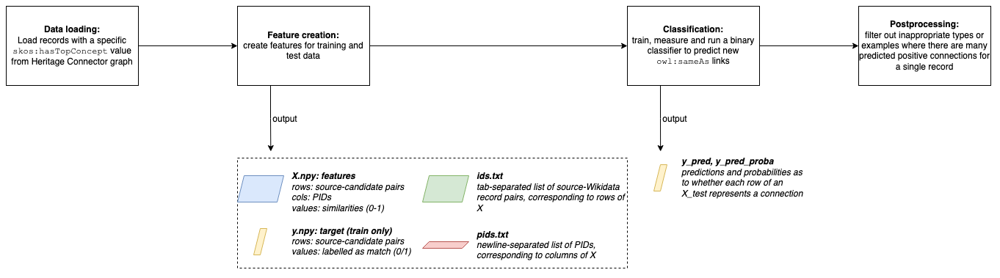

Record Linkage to Wikidata
===============================

The :py:meth:`heritageconnector.disambiguation` module lets you train a classic machine learning classifier to predict connections between a record in the Heritage Connector graph, *a*, and a record in Wikidata, *b*, where *a* and *b* refer to the same real-world entity. These connections can then be loaded into the HC graph as :code:`a-owl:sameAs-b` triples.

The classifier is designed to run separately for each value of :code:`skos:hasTopConcept` (e.g. 'person', 'object'; see :ref:`data-model`). It's also specifically designed for scenarios where:

* there is *limited metadata*, both in the source database and on candidate Wikidata records to be connected; and
* there is *limited training data*: a small number of existing (or created) :code:`owl:sameAs` links to Wikidata in the source database.

For it to perform well in such scenarios, there is a feature extraction step which performs direct comparisons between values of a property in the HC graph and values of an equivalent property on Wikidata. To map HC properties to Wikidata properties, the mapping created by the property *equivalent property (P1628)* is used.

For more information on the model and its performance on Science Museum Group data see our publication [#paper]_.

Process
-----------------------

    
    Steps in the record linkage process

The steps in the record linkage process, as in the diagram above, are:

1. **Data loading**: retrieving data from the HC graph for entities with a specific :code:`skos:hasTopConcept` value. Entities with an existing :code:`owl:sameAs` link to a Wikidata record are considered *training* samples, and those without are *unlabelled* samples, for which we are aiming to predict Wikidata links.
2. **Feature creation**: transforming the data from graph format into features which can be used to train a machine learning classifier. 

   * An *X* matrix stores similarity scores between pairs of HC and Wikidata records (rows), for different properties (columns). 
   * A *y* vector stores true labels - whether a pair of records has been labelled as linking (there is an existing :code:`owl:sameAs` connection between them in the graph)/
   * An *ids.txt* file stores pairs of records, which are the rows of X.
   * A *pids.txt* file stores the properties which have been compared for the data, which are the columns of X.
  
3. **Classification**: training a classifier on *X* created in the last step, to predict *y* values (whether there is an :code:`owl:sameAs` link) for the record pairs in the unlabelled set. The in-built Disambiguator wraps a scikit-learn `DecisionTreeClassifier <https://scikit-learn.org/stable/modules/generated/sklearn.tree.DecisionTreeClassifier.html>`_, so any other scikit-learn classifier could also be used if preferred.
4. **Postprocessing**: there are options to process the predicted new connections after the predictions have been made. For example, excluding predictions where there were many Wikidata connections predicted for one source record, or filtering predicted connections to only those where both records share the same type (:code:`rdf:type`/:code:`wdt:P31` value).

Running the Record Linker
--------------------------

Prerequisites
**************

For the model to run successfully there are the following requirements of the data, which apply to each subset of the data with a :code:`skos:hasTopConcept` value for which a classifier will be trained:

* There are a number (ideally 50+) of :code:`owl:sameAs` links between HC records and Wikidata.
* Every record :code:`s` has a triple :code:`s-rdf:type-o` which describes its type, where every :code:`o` is a URL to a Wikidata QID.

Workflow
*********

Expand each of the code snippets in this section for working code examples.

1. **Create training data** by loading :code:`owl:sameAs` links between records in your collection and Wikidata records into the HC graph. These may have been created through mining descriptions for IDs and URLs (see :py:meth:`heritageconnector.entity_matching.lookup.wikidata_id`), or manually, maybe through crowdsourcing.
2. **Transform training and test data** for records with a specific :code:`skos:hasTopConcept` value to be used by the machine learning classifier. 

    .. raw:: html

        

        
<em>Code snippet</em>

    .. code-block:: python

        from heritageconnector.disambiguation.pipelines import Disambiguator
        
        disambiguator = Disambiguator(table_name="PERSON", **kwargs)
        
        # The limit option can be used below to check the data is being created as expected before running 
        # for the entire dataset.
        disambiguator.save_training_data_to_folder(path = "path/to_data/train", limit=None, **save_kwargs)
        disambiguator.save_test_data_to_folder(path = "path/to_data/test", limit=None, **save_kwargs)

    .. raw:: html

        

3. **Train a classifier and test its performance**. The :code:`Disambiguator` class contains :code:`fit()`, :code:`predict()`, :code:`predict_proba()` and :code:`score()` methods to train a classifier, use it to make predictions and measure its performance. These wrap scikit-learn's DecisionTreeClassifier.

    .. raw:: html

        

        
<em>Code snippet</em>

    .. code-block:: python

        >>> from sklearn.disambiguation.helpers import load_training_data
        >>> from sklearn.model_selection import train_test_split

        >>> # Load training data from folder
        >>> X, y, pairs, pids = load_training_data("path/to_data/train")
        >>> pids
        ['P106', 'P569', 'P21', 'P570', 'P734', 'P735', 'label', 'P31']
        >>> pairs.head(1) # pairs is a DataFrame
                                                            internal_id 	wikidata_id 	is_type
        0 	https://collection.sciencemuseumgroup.org.uk/people/cp21611 	Q56181182 	    True
        >>> X.shape, y.shape # X and y are numpy ndarrays
        ((57887, 8), (57887,))

        >>> # Let's split the training set into a training and test set first so that we can measure
        >>> # the classifier's performance in the next step.
        >>> X_train, X_test, y_train, y_test = train_test_split(X, y, random_state=42, test_size=0.1)

        >>> # Then we can train a classifier and measure its performance at different thresholds.
        >>> clf = Disambiguator('PERSON').fit(X_train, y_train)
        >>> for threshold in [0.5, 0.6, 0.7, 0.8, 0.9]:
        >>>     print(str(threshold) + " --- \n" + clf.score(X_test, y_test, threshold))
        0.5 --- 
        balanced accuracy score: 0.9794740146913499
        precision score: 0.9054054054054054
        recall score: 0.9640287769784173
        0.6 --- 
        balanced accuracy score: 0.9794740146913499
        precision score: 0.9054054054054054
        recall score: 0.9640287769784173
        0.7 --- 
        balanced accuracy score: 0.9794740146913499
        precision score: 0.9054054054054054
        recall score: 0.9640287769784173
        0.8 --- 
        balanced accuracy score: 0.9794740146913499
        precision score: 0.9054054054054054
        recall score: 0.9640287769784173
        0.9 --- 
        balanced accuracy score: 0.9796554699626254
        precision score: 0.9115646258503401
        recall score: 0.9640287769784173

    .. raw:: html

        

4. **Use the classifier to predict new Wikidata links**. Once we have a satisfactorily performing classifier we can use it to predict new Wikidata links for the unconnected records. In the below code snippet we use :code:`clf.get_predictions_table` to produce a new dataframe which is the :code:`pairs` dataframe with predictions and prediction probability columns added, but we also could've used :code:`pred()` or :code:`pred_proba` to get raw predictions.

    .. raw:: html

        

        
<em>Code snippet</em>

    .. code-block:: python

        >>> # Load unlabelled data from folder
        >>> X_new, pairs_new, pids_new = load_training_data(path/to_data/test)
        >>> # Train a new classifier on X (rather than X_train)
        >>> clf = Disambiguator("PERSON").fit(X, y)
        >>> preds_table = clf.get_predictions_table(X_new, pairs_new, threshold=0.9)
        >>> preds_table.sample(3)
                                                                internal_id 	wikidata_id 	is_type 	y_pred_proba 	y_pred
        19251 	https://collection.sciencemuseumgroup.org.uk/people/cp28455 	Q2425993 	    True 	    0.110199 	    False
        52076 	https://collection.sciencemuseumgroup.org.uk/people/cp81358 	Q11886947 	    True 	    0.110199 	    False
        130406 	https://collection.sciencemuseumgroup.org.uk/people/cp39973 	Q3056971 	    True 	    0.998241 	    True

    .. raw:: html

        

5. **Apply optional postprocessing steps**. The :py:meth:`heritageconnector.disambiguation.postprocessing` module contains a few functions to filter the positive predictions made by the classifier. A dataframe containing the *top positive predictions* for each source record can be produced using the method :code:`Disambiguator.get_top_ranked_pairs()` on the predictions table produced in the last step.

    .. raw:: html

        

        
<em>Code snippet</em>

    .. code-block:: python
        
        # Step 1: get top ranked pairs
        top_ranked_pairs = clf.get_top_ranked_pairs(preds_table)
        # Step 2: enforce Wikidata records have same type as linked source records
        top_pairs_filtered = enforce_correct_type(top_ranked_pairs)
        # Step 3: remove any links where the source record has more than 4 positive Wikidata links
        # (all with the same confidence, as lower ranking positive predictions have been removed)
        top_pairs_filtered = filter_max_wikidata_links(top_pairs_filtered, max_wikidata_links=4)

    .. raw:: html

        

Example notebooks
******************

Notebooks to follow the record linkage process from when the data has been created are available in the *demos* folder of the `Heritage Connector repo <https://github.com/TheScienceMuseum/heritage-connector>`_.

---

.. [#paper] Dutia, K, Stack, J. Heritage connector: A machine learning framework for building linked open data from museum collections. *Applied AI Letters. 2021*;e23. https://doi.org/10.1002/ail2.23